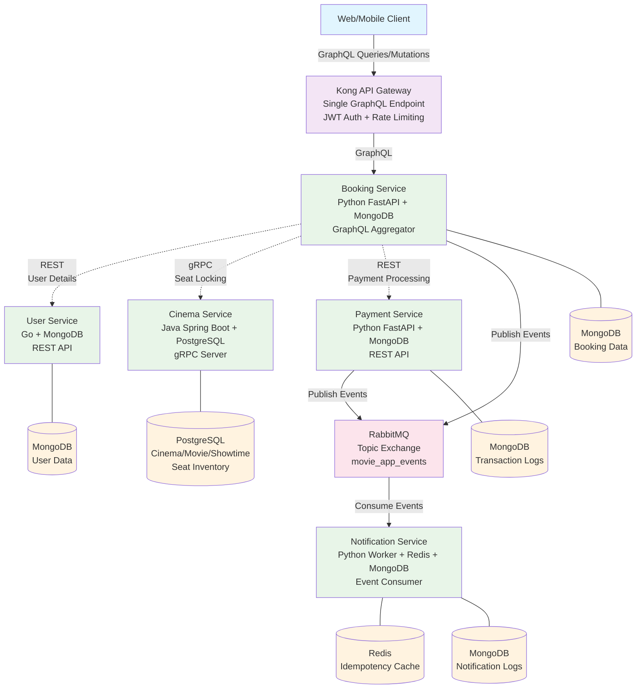

# Movie Ticket Booking System Architecture

## System Architecture Diagram

## Communication Protocol Matrix

| Source Service | Target Service | Protocol | Use Case |
|---------------|---------------|----------|----------|
| Client | Kong Gateway | GraphQL over HTTP | External API access |
| Kong | Booking Service | GraphQL | Request routing |
| Booking Service | Cinema Service | gRPC | High-performance seat locking |
| Booking Service | User Service | REST | User data retrieval |
| Booking Service | Payment Service | REST | Payment processing |
| All Services | RabbitMQ | AMQP | Asynchronous events |
| Notification Service | RabbitMQ | AMQP | Event consumption |

## Database Strategy: Polyglot Persistence

| Service | Database | Rationale |
|---------|----------|-----------|
| User Service | MongoDB | Flexible user profiles, social login data |
| Cinema Service | PostgreSQL | ACID transactions for seat inventory, complex relational queries |
| Booking Service | MongoDB | Flexible booking documents with embedded data |
| Payment Service | MongoDB | Transaction logs with varying payment method data |
| Notification Service | Redis + MongoDB | Redis for fast idempotency checks, MongoDB for audit logs |