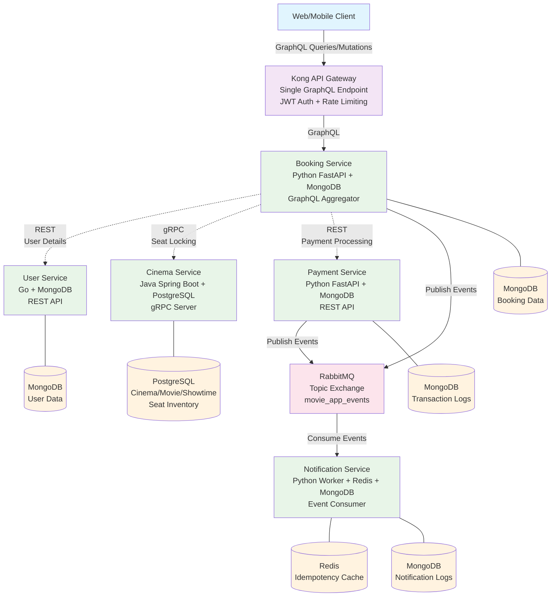

# Movie Ticket Booking System

A comprehensive, production-grade microservices architecture for movie ticket booking, demonstrating modern distributed system design principles with polyglot persistence, multiple communication protocols, and enterprise-level patterns.

## 🏗️ System Architecture



## 📋 Table of Contents

- [Architectural Decisions](#architectural-decisions)
- [Technology Stack](#technology-stack)
- [Prerequisites](#prerequisites)
- [Quick Start](#quick-start)
- [Service Details](#service-details)
- [API Usage Guide](#api-usage-guide)
- [Testing](#testing)
- [Monitoring](#monitoring)
- [Deployment](#deployment)
- [Contributing](#contributing)

## 🏛️ Architectural Decisions

### Communication Protocol Strategy

The system implements a sophisticated communication strategy using different protocols based on specific requirements:

#### **GraphQL (External API)**
- **Purpose**: Single endpoint for frontend clients
- **Benefits**: 
  - Reduces over-fetching of data
  - Enables complex nested queries in one request
  - Strong typing and introspection
- **Use Case**: Client applications can fetch cinema, movie, showtime, and booking data in optimized queries

#### **gRPC (Internal High-Performance)**
- **Purpose**: Critical, high-frequency operations between microservices
- **Benefits**:
  - High performance with Protocol Buffers
  - Strong typing with schema evolution
  - Bi-directional streaming capabilities
- **Use Case**: Seat locking operations between booking-service and cinema-service

#### **REST (Internal Standard)**
- **Purpose**: Standard internal communications
- **Benefits**:
  - Simple, well-understood protocol
  - Easy debugging and testing
  - Wide ecosystem support
- **Use Case**: User data retrieval, payment processing

#### **RabbitMQ (Asynchronous Events)**
- **Purpose**: Decoupled, event-driven communication
- **Benefits**:
  - Reliable message delivery
  - Horizontal scaling
  - Event sourcing capabilities
- **Use Case**: Booking confirmations, notifications, audit logs

### Polyglot Persistence Strategy

Each service uses the most appropriate database technology for its specific needs:

| Service | Database | Rationale |
|---------|----------|-----------|
| **User Service** | MongoDB | Flexible schema for user profiles, social login data, and varying user attributes |
| **Cinema Service** | PostgreSQL | ACID transactions for critical seat inventory, complex relational queries for showtimes |
| **Booking Service** | MongoDB | Document-based booking records with embedded payment and seat information |
| **Payment Service** | MongoDB | Flexible transaction logs accommodating different payment method schemas |
| **Notification Service** | Redis + MongoDB | Redis for high-speed idempotency checks, MongoDB for audit trail and analytics |

### API Gateway Pattern

**Kong Gateway** serves as the single entry point providing:
- **Authentication**: JWT token validation
- **Rate Limiting**: 200 requests/minute per IP
- **Protocol Translation**: HTTP to internal services
- **CORS Handling**: Cross-origin request support
- **Monitoring**: Request/response logging

## 🛠️ Technology Stack

### Microservices
- **User Service**: Go 1.21, Gin, MongoDB Driver, JWT
- **Cinema Service**: Java 17, Spring Boot 3.2, PostgreSQL, gRPC, JPA/Hibernate
- **Booking Service**: Python 3.11, FastAPI, Strawberry GraphQL, MongoDB Motor, gRPC Client
- **Payment Service**: Python 3.11, FastAPI, MongoDB Motor, Pydantic
- **Notification Service**: Python 3.11, aio-pika, Redis, MongoDB Motor

### Infrastructure
- **API Gateway**: Kong 3.4
- **Message Broker**: RabbitMQ 3.12 with Management UI
- **Databases**: PostgreSQL 15, MongoDB 7.0, Redis 7.2
- **Containerization**: Docker & Docker Compose
- **Protocol Buffers**: gRPC service definitions

### Development Tools
- **Database Management**: pgAdmin, Mongo Express, Redis Commander
- **API Testing**: GraphQL Playground, Postman collections
- **Monitoring**: Kong Admin API, RabbitMQ Management UI

## 📋 Prerequisites

- Docker 24.0+ and Docker Compose 2.0+
- Git for cloning the repository
- 8GB+ RAM recommended for running all services
- Ports 5432, 27017, 6379, 5672, 8000-8010, 8080-8082, 15672 available

## 🚀 Quick Start

### 1. Clone the Repository
```bash
git clone https://github.com/Kalpesh-Vala/movie-ticket-booking-system.git
cd movie-ticket-booking-system
```

### 2. Start the Complete System
```bash
# Start all services
docker-compose up -d

# Check service health
docker-compose ps

# View logs for specific service
docker-compose logs -f booking-service
```

### 3. Initialize Sample Data
```bash
# Wait for services to be healthy (2-3 minutes)
docker-compose exec booking-service python scripts/init_sample_data.py
```

### 4. Access the System

| Service | URL | Purpose |
|---------|-----|---------|
| **Kong Gateway** | http://localhost:8000 | Main API endpoint |
| **GraphQL Playground** | http://localhost:8000/graphql | Interactive API explorer |
| **Kong Admin** | http://localhost:8001 | Gateway management |
| **RabbitMQ Management** | http://localhost:15672 | Message broker admin (admin/admin123) |
| **Mongo Express** | http://localhost:8081 | MongoDB explorer (admin/admin123) |
| **pgAdmin** | http://localhost:8080 | PostgreSQL admin (admin@movietickets.com/admin123) |
| **Redis Commander** | http://localhost:8082 | Redis data explorer |

## 🔧 Service Details

### User Service (Go + MongoDB)
**Port**: 8001 | **Database**: MongoDB

**Responsibilities**:
- User registration and authentication
- JWT token generation and validation
- User profile management

**Key Features**:
- Password hashing with bcrypt
- JWT-based authentication
- RESTful API endpoints
- MongoDB integration with proper indexing

**API Endpoints**:
```
POST /api/v1/register - User registration
POST /api/v1/login    - User authentication
GET  /api/v1/users/:id - Get user by ID
PUT  /api/v1/users/:id - Update user
GET  /api/v1/profile   - Get current user profile
```

### Cinema Service (Java + PostgreSQL)
**Ports**: 8002 (REST), 9090 (gRPC) | **Database**: PostgreSQL

**Responsibilities**:
- Cinema, movie, and showtime management
- **Critical**: Seat inventory with pessimistic locking
- gRPC server for high-performance seat operations

**Key Features**:
- PostgreSQL pessimistic locking (`FOR UPDATE`)
- JPA/Hibernate with optimistic locking
- gRPC server implementation
- Comprehensive seat management

**gRPC Methods**:
```protobuf
rpc CheckSeatAvailability(SeatAvailabilityRequest) returns (SeatAvailabilityResponse);
rpc LockSeats(LockSeatsRequest) returns (LockSeatsResponse);
rpc ReleaseSeatLock(ReleaseSeatLockRequest) returns (ReleaseSeatLockResponse);
rpc ConfirmSeatBooking(ConfirmSeatBookingRequest) returns (ConfirmSeatBookingResponse);
```

### Booking Service (Python + MongoDB)
**Port**: 8010 | **Database**: MongoDB

**Responsibilities**:
- **Primary GraphQL aggregator**
- Booking workflow orchestration
- Integration with all other services

**Key Features**:
- Strawberry GraphQL implementation
- gRPC client for cinema service
- REST client for user/payment services
- RabbitMQ event publishing
- Complex booking state management

**GraphQL Operations**:
```graphql
# Queries
query GetBooking($id: String!) {
  getBooking(bookingId: $id) {
    id, status, seats, totalAmount
  }
}

# Mutations
mutation CreateBooking($input: BookingInput!) {
  createBooking(
    userId: $input.userId
    showtimeId: $input.showtimeId
    seatNumbers: $input.seatNumbers
  ) {
    success, booking { id }, message, lockId
  }
}
```

### Payment Service (Python + MongoDB)
**Port**: 8003 | **Database**: MongoDB

**Responsibilities**:
- Payment processing simulation
- Transaction logging and audit trail
- Refund processing

**Key Features**:
- Multiple payment method support
- Comprehensive transaction logging
- Payment gateway simulation
- Fraud detection patterns

### Notification Service (Python Worker)
**No HTTP Port** | **Databases**: Redis + MongoDB

**Responsibilities**:
- RabbitMQ event consumption
- Email/SMS notification simulation
- Idempotency checking with Redis

**Key Features**:
- Async event processing
- Redis-based idempotency
- Multiple notification channels
- Comprehensive logging

## 🔌 API Usage Guide

### Authentication Flow

1. **Register a new user**:
```bash
curl -X POST http://localhost:8000/api/v1/register \
  -H "Content-Type: application/json" \
  -d '{
    "email": "user@example.com",
    "password": "securepassword",
    "first_name": "John",
    "last_name": "Doe"
  }'
```

2. **Login to get JWT token**:
```bash
curl -X POST http://localhost:8000/api/v1/login \
  -H "Content-Type: application/json" \
  -d '{
    "email": "user@example.com",
    "password": "securepassword"
  }'
```

### GraphQL API Examples

**Access GraphQL Playground**: http://localhost:8000/graphql

1. **Browse available movies and showtimes**:
```graphql
query GetMoviesAndShowtimes {
  movies {
    id
    title
    genre
    duration
    showtimes {
      id
      startTime
      cinema {
        name
        location
      }
      availableSeats
      basePrice
    }
  }
}
```

2. **Create a booking** (requires authentication):
```graphql
mutation CreateBooking {
  createBooking(
    userId: "user123"
    showtimeId: "showtime456"
    seatNumbers: ["A1", "A2"]
  ) {
    success
    message
    lockId
    booking {
      id
      status
      totalAmount
      createdAt
    }
  }
}
```

3. **Process payment**:
```graphql
mutation ProcessPayment {
  processPayment(
    bookingId: "booking789"
    paymentMethod: "credit_card"
    paymentDetails: "{\"card_number\":\"4111111111111111\"}"
  ) {
    success
    message
    booking {
      status
      confirmedAt
    }
  }
}
```

### Direct Service APIs

**User Service** (Internal):
```bash
# Get user details
curl -H "Authorization: Bearer <JWT_TOKEN>" \
  http://localhost:8001/api/v1/users/123
```

**Payment Service** (Internal):
```bash
# Process payment
curl -X POST http://localhost:8003/payments \
  -H "Content-Type: application/json" \
  -d '{
    "booking_id": "booking-123",
    "amount": 25.50,
    "payment_method": "credit_card",
    "payment_details": {"card_number": "4111111111111111"}
  }'
```

## 🧪 Testing

### Unit Tests

**Cinema Service** (Java/JUnit):
```bash
cd services/cinema-service
mvn test
```

**User Service** (Go):
```bash
cd services/user-service
go test ./... -v
```

**Python Services**:
```bash
cd services/booking-service
pytest tests/ -v

cd services/payment-service
pytest tests/ -v
```

### Integration Tests

```bash
# Run complete integration test suite
docker-compose -f docker-compose.test.yml up --abort-on-container-exit
```

### Load Testing

```bash
# Install k6
curl https://github.com/grafana/k6/releases/download/v0.45.0/k6-v0.45.0-linux-amd64.tar.gz -L | tar xvz --strip-components 1

# Run booking flow load test
k6 run scripts/load-tests/booking-flow.js
```

## 📊 Monitoring

### Health Checks

```bash
# Check all service health
curl http://localhost:8001/health  # User Service
curl http://localhost:8002/actuator/health  # Cinema Service
curl http://localhost:8010/health  # Booking Service
curl http://localhost:8003/health  # Payment Service
```

### Kong Gateway Metrics

```bash
# Kong status
curl http://localhost:8001/status

# Service configuration
curl http://localhost:8001/services
```

### Database Monitoring

- **PostgreSQL**: Access pgAdmin at http://localhost:8080
- **MongoDB**: Access Mongo Express at http://localhost:8081  
- **Redis**: Access Redis Commander at http://localhost:8082

### Message Queue Monitoring

- **RabbitMQ Management**: http://localhost:15672 (admin/admin123)
- Monitor queues, exchanges, and message rates

## 🚢 Deployment

### Production Considerations

1. **Environment Variables**:
```bash
# Create production environment file
cp .env.example .env.production

# Update with production values
JWT_SECRET=production-secret-key
POSTGRES_PASSWORD=secure-prod-password
MONGODB_PASSWORD=secure-mongo-password
```

2. **SSL/TLS Configuration**:
```yaml
# Update Kong configuration for HTTPS
kong:
  environment:
    KONG_SSL_CERT: /path/to/cert.pem
    KONG_SSL_CERT_KEY: /path/to/key.pem
```

3. **Scaling Services**:
```bash
# Scale booking service for high load
docker-compose up -d --scale booking-service=3

# Scale notification workers
docker-compose up -d --scale notification-service=2
```

### Kubernetes Deployment

```bash
# Deploy to Kubernetes cluster
kubectl apply -f k8s/namespace.yaml
kubectl apply -f k8s/configmaps/
kubectl apply -f k8s/services/
kubectl apply -f k8s/deployments/
```

### CI/CD Pipeline

The system includes GitHub Actions workflows for:
- Automated testing on pull requests
- Docker image building and pushing
- Deployment to staging/production environments

## 📈 Performance Benchmarks

### Expected Performance Metrics

| Operation | Response Time | Throughput |
|-----------|---------------|------------|
| User Login | < 100ms | 1000 req/sec |
| Seat Availability Check | < 50ms | 2000 req/sec |
| Booking Creation | < 200ms | 500 req/sec |
| Payment Processing | < 300ms | 200 req/sec |

### Optimization Features

- **Database Indexing**: Optimized indexes on frequently queried fields
- **Connection Pooling**: Configured for all database connections
- **Redis Caching**: Seat availability and user session caching
- **gRPC**: High-performance binary protocol for critical operations
- **Async Processing**: Non-blocking I/O for all Python services

## 🔧 Development

### Adding a New Service

1. Create service directory: `services/new-service/`
2. Add Dockerfile and requirements
3. Update `docker-compose.yml` with new service
4. Add service configuration to Kong if external access needed
5. Update service discovery and communication patterns

### Database Migrations

**PostgreSQL** (Cinema Service):
```bash
# Create migration
docker-compose exec cinema-service mvn flyway:migrate

# Rollback migration
docker-compose exec cinema-service mvn flyway:undo
```

**MongoDB** (Schema-less, handle in application code):
```python
# Add migration script to services/*/migrations/
python manage.py migrate
```

## 🤝 Contributing

1. Fork the repository
2. Create a feature branch: `git checkout -b feature/new-feature`
3. Follow coding standards for each language
4. Add comprehensive tests
5. Update documentation
6. Submit a pull request

### Code Standards

- **Go**: Follow `gofmt` and `golint` standards
- **Java**: Google Java Style Guide
- **Python**: PEP 8 with Black formatter
- **API**: OpenAPI 3.0 documentation required

## 📝 License

This project is licensed under the MIT License - see the [LICENSE](LICENSE) file for details.

## 🆘 Support

For support and questions:

- **Documentation**: Check this README and inline code comments
- **Issues**: Create GitHub issues for bugs and feature requests
- **Discussions**: Use GitHub Discussions for general questions

## 🙏 Acknowledgments

- **Kong Gateway**: For excellent API gateway capabilities
- **Spring Boot**: For robust Java microservice framework
- **FastAPI**: For high-performance Python web framework
- **gRPC**: For efficient inter-service communication
- **RabbitMQ**: For reliable message queuing

---

## 🔍 Quick Reference

### Service Ports
- Kong Gateway: 8000 (HTTP), 8001 (Admin)
- User Service: 8001
- Cinema Service: 8002 (REST), 9090 (gRPC)
- Payment Service: 8003
- Booking Service: 8010
- PostgreSQL: 5432
- MongoDB: 27017
- Redis: 6379
- RabbitMQ: 5672, 15672 (Management)

### Key Commands
```bash
# Start system
docker-compose up -d

# View logs
docker-compose logs -f [service-name]

# Scale service
docker-compose up -d --scale booking-service=3

# Rebuild specific service
docker-compose build booking-service

# Stop system
docker-compose down

# Remove all data
docker-compose down -v
```

This comprehensive system demonstrates enterprise-grade microservice architecture with modern technology choices, robust error handling, and production-ready patterns.